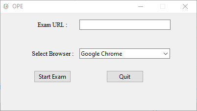

<h1 align = "center">Online Protracted Examination System</h1>

 
<ul>
  <h2><li>Secure System for online examination</li></h2>
  <h2><li>Secure System for online examination</li></h2>
  <h2><li>Easy installation</li></h2>
</ul>

 

# Usage instructions

 

## You have to enter the Exam Url.
## Then You have to choose Browser.
## Currently only three major browser is supported Firefox, Chrome and Edge.

  

  

# Contributing
Pull requests are welcome. For major changes, please open an issue first to discuss what you would like to change.

# License
[GPL v3.0](./public/LICENSE)